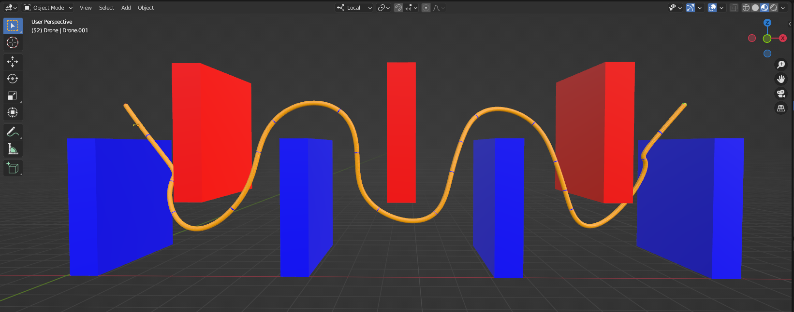

# Aerial Robotics - Path Following Algorithm for Quadcopter

## Introduction

This project focuses on implementing aerial robotics algorithms for quadcopter path planning and control. The codebase contains several key components for simulating quadcopter dynamics, generating trajectories, and visualizing results.

## Key Components

### 1. Quadcopter Simulation

The project uses Blender for 3D visualization and simulation of the quadcopter. The main simulation loop is implemented in `main.py`, which handles:
- Initialization of the environment
- Setting up the quadcopter model
- Running the simulation loop
- Logging state and control data

### 2. Path Planning

The project implements the RRT* (Rapidly-exploring Random Tree Star) algorithm for path planning. This is evident from the `rrt_star.py` file mentioned in the main script.

### 3. Trajectory Generation

After path planning, a minimum snap trajectory is generated using `trajectory_gen.py`. This creates a smooth trajectory for the quadcopter to follow.

### 4. Control

The project implements a controller for the quadcopter, likely a PID or similar algorithm, in `control.py`.

### 5. User Code

The `usercode.py` file contains a `state_machine` class that handles:
- Loading and processing trajectory data
- Implementing the step function for quadcopter control
- Logging and visualization of results

### 6. Visualization

The project uses `matplotlib` for visualizing results, including:
- 3D trajectory plots
- Position and velocity plots for each axis

### 7. Environment Creation

The `create_env.py` file handles the creation of the simulation environment, including:
- Parsing environment data from text files
- Creating obstacle geometries
- Implementing obstacle bloating for collision avoidance

## Results

The following is an example of the output generated by the simulation. The image demonstrates the quadcopter's path and trajectory in the simulated environment.

## Usage

To run the simulation:
1. Ensure Blender is installed and properly configured.
2. Set up the Python environment with required dependencies.
3. Run the `main.py` script within Blender.

## Future Improvements

Potential areas for enhancement include:
- Implementing more advanced control algorithms
- Enhancing visualization capabilities
- Optimizing performance for real-time applications

This project provides a comprehensive framework for simulating and controlling quadcopters in complex environments, making it valuable for research and educational purposes in aerial robotics.

## References

- [Code: usercode.py](https://github.com/noopur2805/RBE_595_Aerial_Robotics/blob/main/Path%20Following%20Quadcopter/src/usercode.py)
- [Code: main.py](https://github.com/noopur2805/RBE_595_Aerial_Robotics/blob/main/Path%20Following%20Quadcopter/src/main.py)
